----------------------------
# Descipcion

Cap es una máquina Linux de dificultad fácil en HackTheBox. El acceso inicial se consigue explotando una vulnerabilidad IDOR en un panel web para descargar una antigua captura de red. Al analizar este archivo con Wireshark, se extraen credenciales en texto plano que permiten entrar al sistema mediante SSH. Finalmente, la escalada de privilegios se logra abusando de la capability cap_setuid del binario de Python3 para obtener una shell como root.

----------------------------


# Reconocimiento

## Nmap

> Comenzamos la fase de reconocimiento realizando un escaneo exhaustivo de puertos utilizando **Nmap** para identificar los servicios expuestos en la máquina objetivo. Primero, ejecutamos un escaneo rápido para descubrir puertos abiertos:


```bash
nmap -p- --open --min-rate 5000 -n -Pn -sS -vvv 10.129.8.60
```

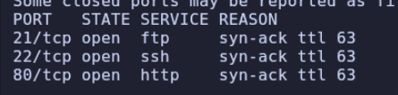

> Una vez identificados los puertos principales (21, 22, 80), lanzamos un escaneo dirigido para detectar las versiones exactas de los servicios en ejecución y probar los scripts básicos de enumeración:

```bash
nmap -p21,22,80 -sC -sV 10.129.8.60
```

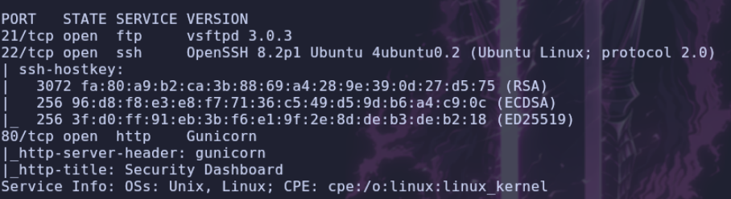

## Website

> Utilizamos la herramienta **WhatWeb** para analizar las tecnologías del servidor web expuesto en el puerto 80:

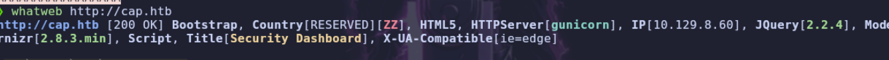


> Al acceder a la web por el navegador, nos encontramos con un `Dashboard` administrativo que muestra eventos de seguridad y métricas del sistema.

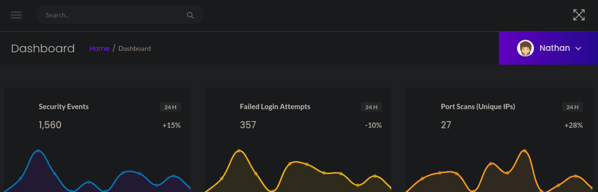 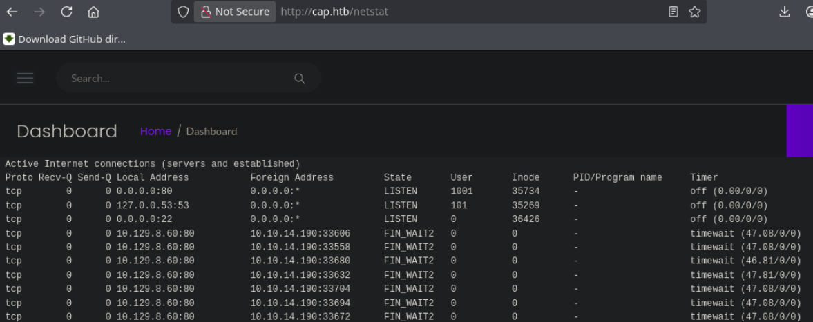 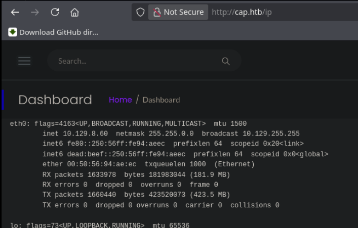


> Navegando por el panel, identificamos una pestaña interesante llamada **Security Snapshot**:

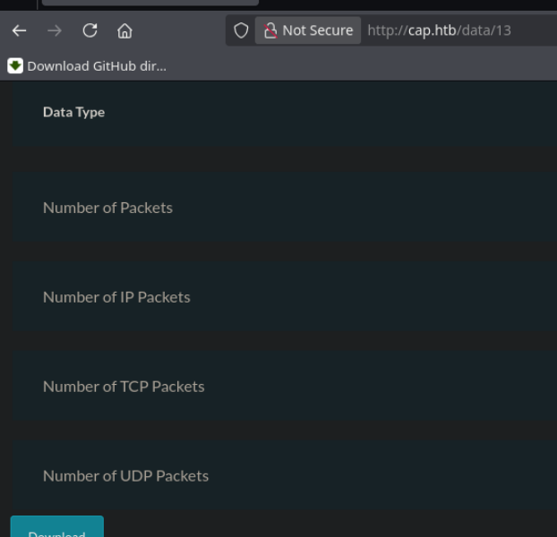

> Esta sección parece generar capturas del tráfico de red, devolviéndonos un identificador asociado en la URL. Analizando el comportamiento de este parámetro, comprobamos si la aplicación es vulnerable a **IDOR**.

# Shell como `nathan`

## IDOR

> Modificamos el identificador de la URL y probamos con el **ID `0`**:

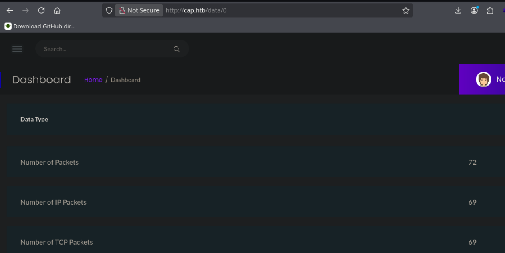

> Logramos acceder a un registro antiguo que almacena un archivo de captura de tráfico de red. Procedemos a descargarlo para analizar su contenido.

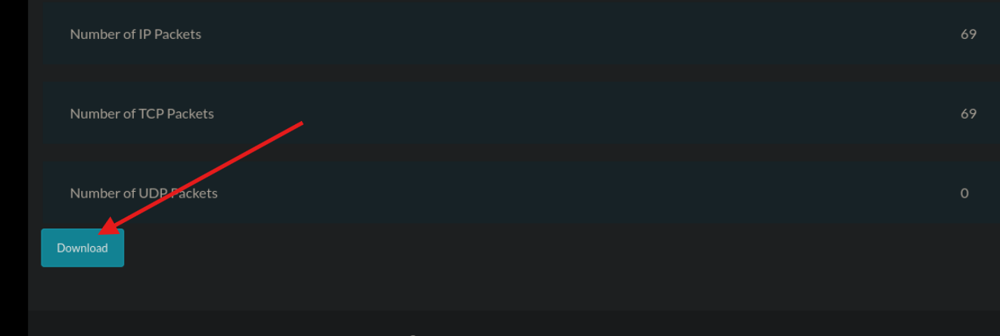


## Analisis PCAP

> Abrimos el archivo `.pcap` con `Wireshark`. Explorando los paquetes interceptados en esa captura, localizamos tráfico dirigido al servicio FTP del servidor.

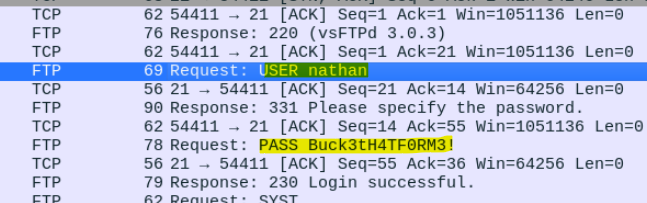

> Dado que el protocolo `FTP` transmite datos en texto plano, seguimos el flujo `TCP` y logramos extraer unas credenciales de acceso válidas:

```
User: nathan
Pass: Buck3tH4TF0RM3!
```

## SSH

> Con las credenciales obtenidas, intentamos la reutilización de contraseñas (Password Reuse) para acceder al servidor mediante el servicio SSH:

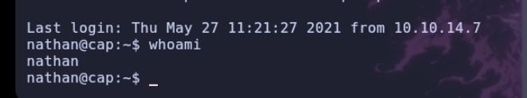

> El acceso se realiza correctamente. Logramos entrar como el usuario `nathan` y, en nuestro propio directorio de trabajo, encontramos la primera flag (`user.txt`).

# Shell como `root`

> Para lograr el compromiso total del sistema, iniciamos la fase de enumeración interna. Comprobamos los permisos de `sudo` y buscamos binarios `SUID`, pero no encontramos ningún vector de ataque viable por esas vías.

## `Capabilities`

> A continuación, pasamos a revisar las **Capabilities** de los archivos del sistema, ejecutando el siguiente comando:

```bash
getcap -r / 2>/dev/null
```

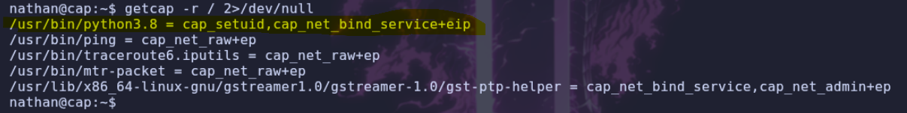

> Los resultados revelan una configuración crítica: el binario de **Python3** tiene asignada la capability `cap_setuid`. Esto permite al ejecutable manipular el UID de los procesos, lo que nos permite ejecutar código como el usuario root.

## Explotacion

> Explotamos esta vulnerabilidad ejecutando un `one-liner` en Python que establece nuestro UID a `0` (root) e invoca una consola de comandos interactiva:

```bash
python3 -c 'import os; os.setuid(0); os.execl("/bin/sh", "sh")'
```

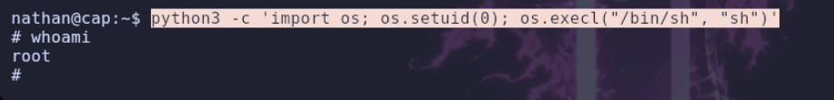

> Obtenemos acceso a `root`, la flag se encuentra en `/root/root.txt`